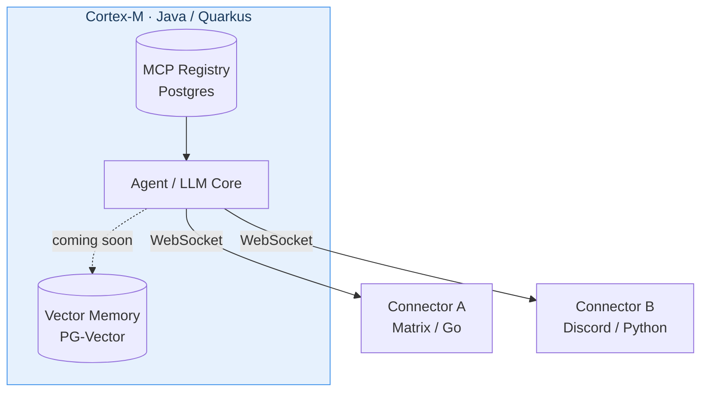

# Architecture

Cortex-M is a cloud-native personal assistant microservice built on [Quarkus](https://quarkus.io/), exposing its capabilities to external services via **connector clients** over WebSocket.

## Components

| Component      | Technology              | Notes                                               |
|----------------|-------------------------|-----------------------------------------------------|
| Main Service   | Java 25 + Quarkus 3.x   | Core agent logic, MCP orchestration, connector hub  |
| Database       | PostgreSQL              | MCP server registry, config, state                  |
| Vector Store   | PG-Vector               | Semantic memory *(coming soon)*                     |
| Connectors     | Any language            | Platform bridges (Matrix, Discord, …)               |

## Diagram

## Current State

| Area                     | Status          |
|--------------------------|-----------------|
| MCP server registry      | ✅ Implemented  |
| Connector WebSocket hub  | ✅ Implemented  |
| Session-based auth       | ✅ Implemented (in-memory, Postgres migration planned) |
| Vector memory store      | ✅ Implemented  |
| Agent vector store access| ✅ Implemented  |
| Matrix connector         | 🔜 Planned      |
| Docker Compose setup     | 🔜 Planned      |
| Proactive scheduling     | 🔜 Planned      |
