# Architecture

Cortex-M is a cloud-native personal assistant microservice built on [Quarkus](https://quarkus.io/), exposing its capabilities to external services via **connector clients** over WebSocket.

## Components

| Component      | Technology              | Notes                                               |
|----------------|-------------------------|-----------------------------------------------------|
| Main Service   | Java 25 + Quarkus 3.x   | Core agent logic, MCP orchestration, connector hub  |
| Database       | PostgreSQL              | MCP server registry, config, state                  |
| Vector Store   | PG-Vector               | Semantic memory *(coming soon)*                     |
| Connectors     | Any language            | Platform bridges (Matrix, Discord, …)               |

## Diagram

```mermaid
graph TB
    subgraph cortex["Cortex-M · Java / Quarkus"]
        db[(MCP Registry\nPostgres)]
        agent[Agent / LLM Core]
        mem[(Vector Memory\nPG-Vector)]

        db --> agent
        agent -. coming soon .-> mem
    end

    ca[Connector A\nMatrix / Go]
    cb[Connector B\nDiscord / Python]

    agent -- WebSocket --> ca
    agent -- WebSocket --> cb

    style cortex fill:#4695EB22,stroke:#4695EB,color:#1a3a5c
```

## Current State

| Area                     | Status          |
|--------------------------|-----------------|
| MCP server registry      | ✅ Implemented  |
| Connector WebSocket hub  | ✅ Implemented  |
| Session-based auth       | ✅ Implemented (in-memory, Postgres migration planned) |
| Vector memory store      | ✅ Implemented  |
| Agent vector store access| ✅ Implemented  |
| Matrix connector         | 🔜 Planned      |
| Docker Compose setup     | 🔜 Planned      |
| Proactive scheduling     | 🔜 Planned      |
