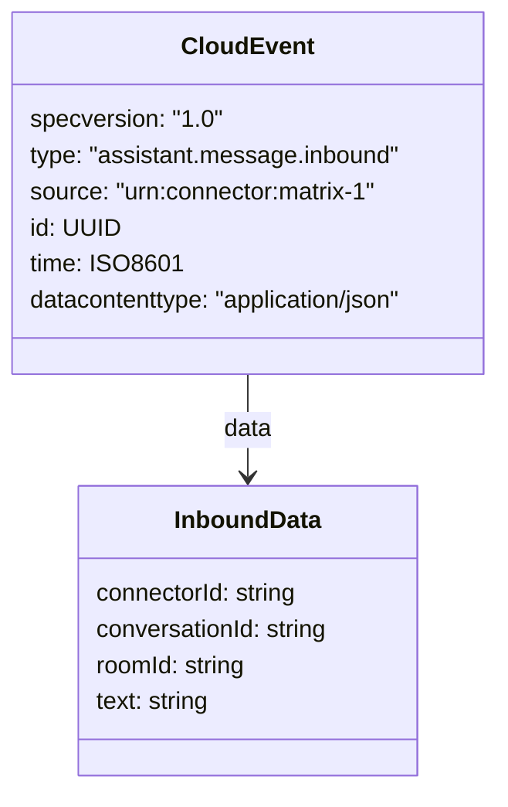

# Connector Protocol

Connectors are lightweight services that bridge a chat platform (Matrix, Discord, Slack, …) to Cortex-M.
They communicate over **WebSocket** using **[CloudEvents 1.0](https://cloudevents.io/)** JSON envelopes.

Because connectors initiate the connection, they never need to be publicly exposed.

---

## Lifecycle

```mermaid
sequenceDiagram
    participant C as Connector
    participant M as Cortex-M

    C->>M: GET /connector
    M-->>C: 200 OK &lt;sessionId&gt;

    C->>M: WS /connector/&lt;sessionId&gt;
    M-->>C: Connection accepted

    C->>M: CloudEvent (assistant.message.inbound)
    M-->>C: CloudEvent (assistant.message.outbound)

    note over C,M: Message exchange repeats…
```

---

## Step 1 — Obtain a Session Token

```
GET /connector
```

Returns a plain-text UUID that must be used as the WebSocket path parameter.
Sessions are currently kept in-memory; a Postgres-backed store is planned.

**Example (curl):**

```bash
SESSION=$(curl -s http://localhost:8080/connector)
echo $SESSION
# e.g. 3f2a1b4c-8d9e-4f0a-b1c2-d3e4f5a6b7c8
```

---

## Step 2 — Open the WebSocket

```
WS /connector/<sessionId>
```

The server validates the session on `@OnOpen`. An invalid or missing session causes the connection to be closed
immediately with an `UnauthorizedException`.

**Example (wscat):**

```bash
wscat -c ws://localhost:8080/connector/$SESSION
```

---

## Step 3 — Send a Message (Inbound Event)

Send a CloudEvents 1.0 JSON object with `type: "assistant.message.inbound"`.

### Schema



| Field                 | Type   | Required | Description                                                   |
|-----------------------|--------|----------|---------------------------------------------------------------|
| `specversion`         | string | ✅        | Always `"1.0"`                                                |
| `type`                | string | ✅        | Always `"assistant.message.inbound"`                          |
| `source`              | string | ✅        | URN identifying this connector, e.g. `urn:connector:matrix-1` |
| `id`                  | string | ✅        | Unique event ID (UUID recommended)                            |
| `time`                | string | ✅        | ISO 8601 timestamp                                            |
| `datacontenttype`     | string | ✅        | Always `"application/json"`                                   |
| `data.connectorId`    | string | ✅        | Stable identifier for this connector instance                 |
| `data.conversationId` | string | ✅        | Identifies the ongoing conversation                           |
| `data.roomId`         | string | ❌        | Platform-specific room/channel ID (passed through)            |
| `data.text`           | string | ✅        | The user's message text                                       |

### Example

```json
{
  "specversion": "1.0",
  "type": "assistant.message.inbound",
  "source": "urn:connector:matrix-1",
  "id": "b3c0c2f0-1234-5678-abcd-ef0123456789",
  "time": "2026-02-23T14:00:00Z",
  "datacontenttype": "application/json",
  "data": {
    "connectorId": "matrix-1",
    "conversationId": "conv-abc",
    "roomId": "!abc:example.org",
    "text": "Hey Cortex, what's on my schedule?"
  }
}
```

---

## Step 4 — Receive the Reply (Outbound Event)

Cortex-M responds synchronously on the same WebSocket connection with `type: "assistant.message.outbound"`.

### Schema

| Field                 | Type   | Description                           |
|-----------------------|--------|---------------------------------------|
| `specversion`         | string | Always `"1.0"`                        |
| `type`                | string | Always `"assistant.message.outbound"` |
| `source`              | string | Always `"urn:cortex-m"`               |
| `id`                  | string | New UUID generated per response       |
| `time`                | string | ISO 8601 timestamp of the response    |
| `datacontenttype`     | string | Always `"application/json"`           |
| `data.connectorId`    | string | Echoed from the inbound event         |
| `data.conversationId` | string | Echoed from the inbound event         |
| `data.text`           | string | The assistant's reply                 |

### Example

```json
{
  "specversion": "1.0",
  "type": "assistant.message.outbound",
  "source": "urn:cortex-m",
  "id": "c4d1e2f3-abcd-1234-5678-9abcdef01234",
  "time": "2026-02-23T14:00:01Z",
  "datacontenttype": "application/json",
  "data": {
    "connectorId": "matrix-1",
    "conversationId": "conv-abc",
    "text": "You have a meeting at 15:00 with the team."
  }
}
```

---

## Error Handling

| Situation                 | Behaviour                                            |
|---------------------------|------------------------------------------------------|
| Invalid / expired session | Connection closed immediately on `@OnOpen`           |
| Unknown CloudEvent `type` | Message silently ignored; `null` returned (no reply) |
| LLM / tool error          | Exception propagated; connection may be closed       |

---

## Known Limitations

- Sessions are **in-memory only**. Restarting Cortex-M invalidates all active sessions.
- There is currently **no reconnection handshake**; connectors must re-request a session token after a restart.
- The protocol is **work in progress** and may change before a stable release.
